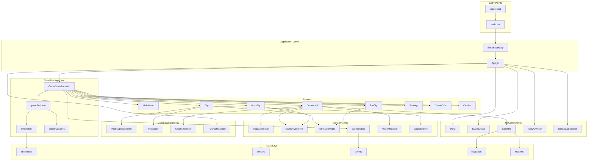
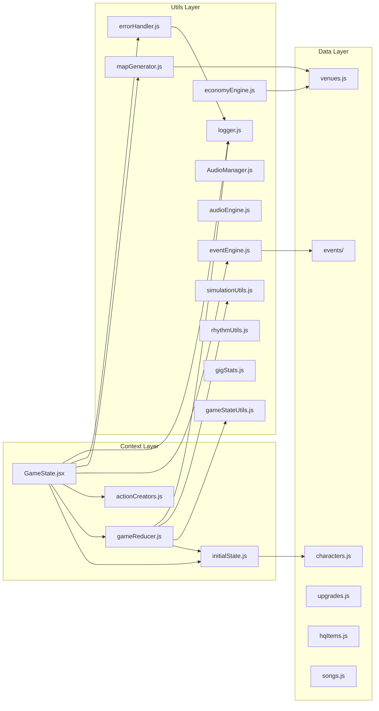
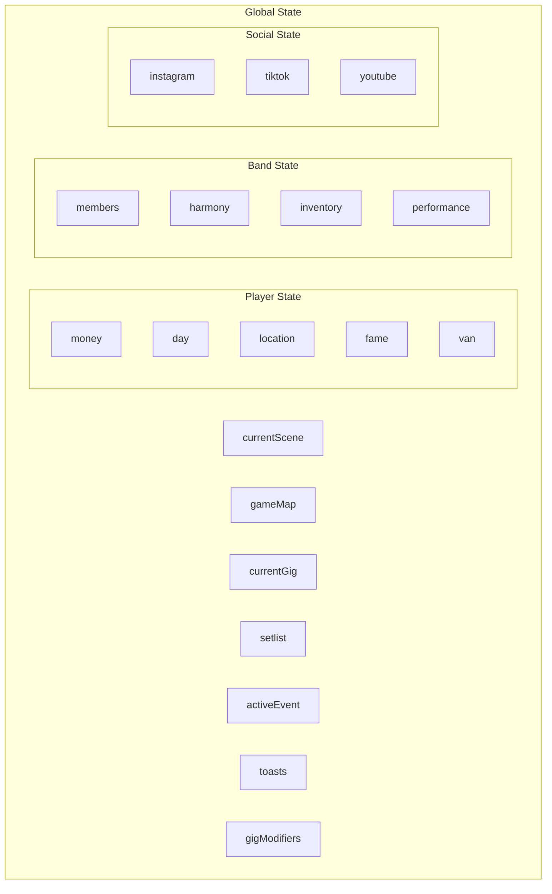
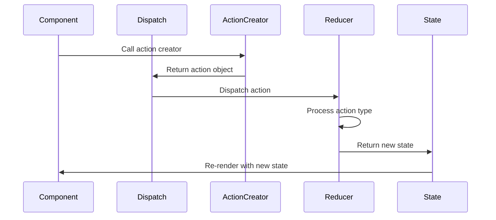
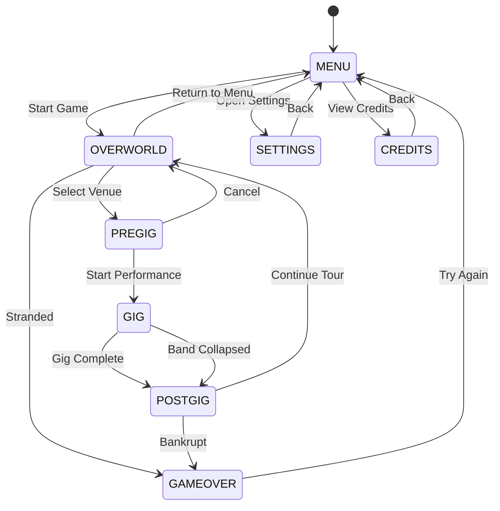
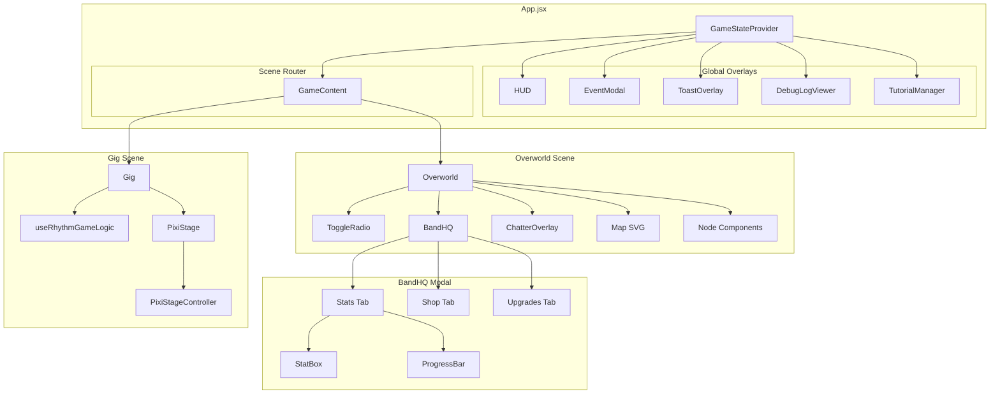
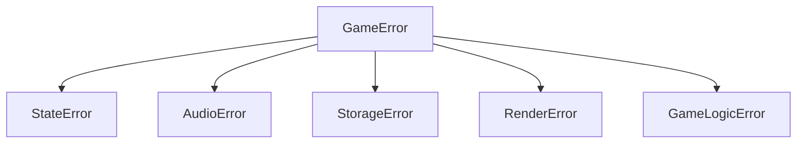
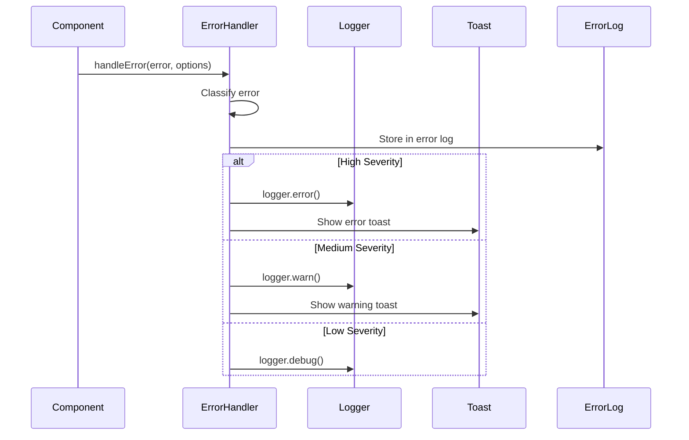

# Neurotoxic Game Architecture

This document provides a comprehensive overview of the game's architecture, including module relationships, state management, and component interactions.

## Table of Contents

1. [High-Level Architecture](#high-level-architecture)
2. [Module Dependency Graph](#module-dependency-graph)
3. [State Management](#state-management)
4. [Scene Flow](#scene-flow)
5. [Component Hierarchy](#component-hierarchy)
6. [Error Handling](#error-handling)

---

## High-Level Architecture



---

## Module Dependency Graph



---

## State Management

### State Structure



### Action Flow



### Action Types

| Action Type         | Description          | Payload                    |
| ------------------- | -------------------- | -------------------------- |
| `CHANGE_SCENE`      | Navigate to a scene  | `string` (scene name)      |
| `UPDATE_PLAYER`     | Update player stats  | `object` (partial player)  |
| `UPDATE_BAND`       | Update band stats    | `object` (partial band)    |
| `UPDATE_SOCIAL`     | Update social media  | `object` (partial social)  |
| `SET_MAP`           | Set generated map    | `object` (map data)        |
| `START_GIG`         | Begin gig sequence   | `object` (venue)           |
| `SET_ACTIVE_EVENT`  | Show event modal     | `object` (event) or `null` |
| `APPLY_EVENT_DELTA` | Apply event effects  | `object` (delta)           |
| `ADVANCE_DAY`       | Progress to next day | none                       |
| `LOAD_GAME`         | Load saved state     | `object` (save data)       |
| `RESET_STATE`       | Reset to initial     | none                       |

---

## Scene Flow



---

## Component Hierarchy



---

## Error Handling

### Error Hierarchy



### Error Flow



### Error Categories

| Category     | Description              | Severity | Recoverable |
| ------------ | ------------------------ | -------- | ----------- |
| `STATE`      | State management errors  | High     | Yes         |
| `RENDER`     | Rendering/display errors | High     | No          |
| `AUDIO`      | Audio playback issues    | Low      | Yes         |
| `STORAGE`    | LocalStorage operations  | Medium   | Yes         |
| `GAME_LOGIC` | Game rule violations     | Medium   | Yes         |
| `UNKNOWN`    | Unclassified errors      | Medium   | Yes         |

---

## File Structure

```
src/
├── main.jsx                    # Entry point
├── App.jsx                     # Root component
├── index.css                   # Global styles
│
├── context/                    # State management
│   ├── GameState.jsx          # Provider & hooks
│   ├── initialState.js        # Default state
│   ├── gameReducer.js         # Reducer logic
│   └── actionCreators.js      # Action factories
│
├── scenes/                     # Major game scenes
│   ├── MainMenu.jsx
│   ├── Overworld.jsx
│   ├── PreGig.jsx
│   ├── Gig.jsx
│   ├── PostGig.jsx
│   ├── Settings.jsx
│   ├── Credits.jsx
│   └── GameOver.jsx
│
├── ui/                         # UI components
│   ├── HUD.jsx
│   ├── EventModal.jsx
│   ├── BandHQ.jsx
│   ├── UpgradeMenu.jsx
│   ├── ToastOverlay.jsx
│   ├── DebugLogViewer.jsx
│   ├── CrashHandler.jsx
│   └── GlitchButton.jsx
│
├── components/                 # Game components
│   ├── PixiStageController.js
│   ├── PixiStage.jsx
│   ├── ChatterOverlay.jsx
│   └── TutorialManager.jsx
│
├── hooks/                      # Custom hooks
│   ├── useRhythmGameLogic.js
│   ├── useTravelLogic.js
│   └── usePurchaseLogic.js
│
├── utils/                      # Utility modules
│   ├── eventEngine.js
│   ├── economyEngine.js
│   ├── simulationUtils.js
│   ├── mapGenerator.js
│   ├── AudioManager.js
│   ├── audioEngine.js
│   ├── errorHandler.js
│   ├── logger.js
│   ├── gameStateUtils.js
│   ├── rhythmUtils.js
│   ├── gigStats.js
│   ├── imageGen.js
│   ├── pixiStageUtils.js
│   ├── socialEngine.js
│   └── eventResolver.js
│
├── systems/                    # Game systems
│   └── SoundSynthesizer.js
│
└── data/                       # Static data
    ├── characters.js
    ├── venues.js
    ├── songs.js
    ├── upgrades.js
    ├── hqItems.js
    ├── chatter.js
    └── events/
        ├── band.js
        ├── gig.js
        ├── special.js
        ├── financial.js
        └── transport.js
```

---

## Dependency Injection Pattern

The codebase uses a lightweight dependency injection approach through React Context:

```javascript
// Provider wraps the app
;<GameStateProvider>
  <App />
</GameStateProvider>

// Components consume via hook
const { player, updatePlayer, addToast } = useGameState()
```

This pattern ensures:

- **Testability**: Components can receive mock state/actions
- **Decoupling**: Components don't import state directly
- **Consistency**: Single source of truth for game state

---

## Best Practices

1. **State Updates**: Always use action creators instead of raw dispatch
2. **Error Handling**: Use the centralized `handleError` function
3. **Logging**: Use the `logger` utility for consistent logging
4. **Type Safety**: Action types are centralized in `ActionTypes` enum
5. **Modularity**: Keep files focused on single responsibilities

_Documentation sync: dependency/tooling baseline reviewed on 2026-02-17._
