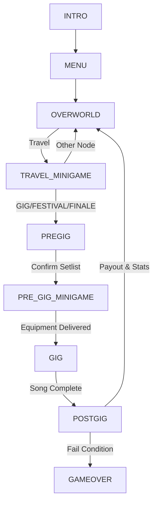

<!-- TODO: Implement this -->
# Neurotoxic Game Architecture

This document is a code-aligned architecture snapshot for the current `main` app runtime.

## Runtime Overview

- **App shell**: `src/main.jsx` mounts `App` and imports global styles from `src/index.css`.
- **Root composition**: `src/App.jsx` wraps the game in `ErrorBoundary` + `GameStateProvider`, then renders scene content, overlays, analytics, and dev-only debug tools.
- **Scene routing**: scene selection is controlled by `currentScene` in global state. The overworld supports multiple node types: `START`, `GIG`, `FESTIVAL`, `REST_STOP`, `SPECIAL`, and `FINALE`.
- **Lazy loading**: heavy scenes are lazy-loaded through `createNamedLazyLoader` (`src/utils/lazySceneLoader.js`) to reduce first-render bundle work.

## Source Layout (Current)

```text
src
├── assets/
├── components
│   ├── hud
│   │   ├── ComboDisplay.jsx
│   │   ├── ControlsHint.jsx
│   │   ├── GameOverOverlay.jsx
│   │   ├── HealthBar.jsx
│   │   ├── LaneInputArea.jsx
│   │   ├── OverloadMeter.jsx
│   │   ├── PauseButton.jsx
│   │   ├── ScoreDisplay.jsx
│   │   └── ToxicModeFlash.jsx
│   ├── postGig
│   │   ├── CompletePhase.jsx
│   │   ├── DealsPhase.jsx
│   │   ├── ReportPhase.jsx
│   │   └── SocialPhase.jsx
│   ├── stage
│   │   ├── BaseStageController.js
│   │   ├── CrowdManager.js
│   │   ├── EffectManager.js
│   │   ├── LaneManager.js
│   │   ├── NoteManager.js
│   │   ├── RoadieStageController.js
│   │   ├── TourbusStageController.js
│   │   └── utils.js
│   ├── ChatterOverlay.jsx
│   ├── GigHUD.jsx
│   ├── HecklerOverlay.jsx
│   ├── MapConnection.jsx
│   ├── MapNode.jsx
│   ├── MinigameSceneFrame.jsx
│   ├── PixiStage.jsx
│   ├── PixiStageController.js
│   ├── ToggleRadio.jsx
│   └── TutorialManager.jsx
├── context
│   ├── reducers
│   │   ├── bandReducer.js
│   │   ├── eventReducer.js
│   │   ├── gigReducer.js
│   │   ├── minigameReducer.js
│   │   ├── playerReducer.js
│   │   ├── questReducer.js
│   │   ├── sceneReducer.js
│   │   ├── socialReducer.js
│   │   └── systemReducer.js
│   ├── GameState.jsx
│   ├── actionCreators.js
│   ├── actionTypes.js
│   ├── gameConstants.js
│   ├── gameReducer.js
│   └── initialState.js
├── data
│   ├── chatter
│   │   ├── index.js
│   │   ├── standardChatter.js
│   │   └── venueChatter.js
│   ├── events
│   │   ├── band.js
│   │   ├── consequences.js
│   │   ├── constants.js
│   │   ├── crisis.js
│   │   ├── financial.js
│   │   ├── gig.js
│   │   ├── index.js
│   │   ├── quests.js
│   │   ├── relationshipEvents.js
│   │   ├── special.js
│   │   └── transport.js
│   ├── brandDeals.js
│   ├── characters.js
│   ├── chatter.js
│   ├── hqItems.js
│   ├── platforms.js
│   ├── postOptions.js
│   ├── socialTrends.js
│   ├── songs.js
│   ├── upgradeCatalog.js
│   └── venues.js
├── hooks
│   ├── minigames
│   │   ├── constants.js
│   │   ├── useRoadieLogic.js
│   │   └── useTourbusLogic.js
│   ├── rhythmGame
│   │   ├── useRhythmGameAudio.js
│   │   ├── useRhythmGameInput.js
│   │   ├── useRhythmGameLoop.js
│   │   ├── useRhythmGameScoring.js
│   │   └── useRhythmGameState.js
│   ├── useArrivalLogic.js
│   ├── useAudioControl.js
│   ├── useBandHQModal.js
│   ├── useGigEffects.js
│   ├── useGigInput.js
│   ├── useLeaderboardSync.js
│   ├── usePurchaseLogic.js
│   ├── useQuestsModal.js
│   ├── useRhythmGameLogic.js
│   └── useTravelLogic.js
├── scenes
│   ├── Credits.jsx
│   ├── GameOver.jsx
│   ├── Gig.jsx
│   ├── IntroVideo.jsx
│   ├── MainMenu.jsx
│   ├── Overworld.jsx
│   ├── PostGig.jsx
│   ├── PreGig.jsx
│   ├── RoadieRunScene.jsx
│   ├── Settings.jsx
│   └── TourbusScene.jsx
├── ui
│   ├── bandhq
│   │   ├── DetailedStatsTab.jsx
│   │   ├── LeaderboardTab.jsx
│   │   ├── SetlistTab.jsx
│   │   ├── SettingsTab.jsx
│   │   ├── ShopItem.jsx
│   │   ├── ShopTab.jsx
│   │   ├── StatsTab.jsx
│   │   └── UpgradesTab.jsx
│   ├── shared
│   │   ├── ActionButton.jsx
│   │   ├── AnimatedTypography.jsx
│   │   ├── BrutalistUI.jsx
│   │   ├── Icons.jsx
│   │   ├── Modal.jsx
│   │   ├── SettingsPanel.jsx
│   │   ├── ToggleSwitch.jsx
│   │   ├── Tooltip.jsx
│   │   ├── VolumeSlider.jsx
│   │   ├── index.jsx
│   │   └── propTypes.js
│   ├── BandHQ.jsx
│   ├── CrashHandler.jsx
│   ├── DebugLogViewer.jsx
│   ├── EventModal.jsx
│   ├── GigModifierButton.jsx
│   ├── GlitchButton.jsx
│   ├── HUD.jsx
│   ├── QuestsModal.jsx
│   └── ToastOverlay.jsx
├── utils
│   ├── audio
│   │   ├── ambient.js
│   │   ├── assets.js
│   │   ├── cleanupUtils.js
│   │   ├── constants.js
│   │   ├── drumMappings.js
│   │   ├── midiPlayback.js
│   │   ├── midiUtils.js
│   │   ├── playback.js
│   │   ├── playbackUtils.js
│   │   ├── proceduralMetal.js
│   │   ├── selectionUtils.js
│   │   ├── setup.js
│   │   ├── sharedBufferUtils.js
│   │   ├── songUtils.js
│   │   ├── state.js
│   │   └── timingUtils.js
│   ├── AudioManager.js
│   ├── arrivalUtils.js
│   ├── audioContextState.js
│   ├── audioEngine.js
│   ├── crypto.js
│   ├── economyEngine.js
│   ├── errorHandler.js
│   ├── eventEngine.js
│   ├── gameStateUtils.js
│   ├── gigStats.js
│   ├── hecklerLogic.js
│   ├── imageGen.js
│   ├── lazySceneLoader.js
│   ├── locationI18n.js
│   ├── logger.js
│   ├── mapGenerator.js
│   ├── mapUtils.js
│   ├── purchaseLogicUtils.js
│   ├── rhythmUtils.js
│   ├── saveValidator.js
│   ├── simulationUtils.js
│   ├── socialEngine.js
│   ├── traitLogic.js
│   ├── traitUtils.js
│   ├── unlockCheck.js
│   ├── unlockManager.js
│   └── upgradeUtils.js
├── App.jsx
├── i18n.js
├── index.css
└── main.jsx
```

## State Model

Global state lives in `GameStateProvider` and is mutated only through reducer actions.

### High-level slices

- `currentScene`
- `player` (money/day/time/location/van/fame/tutorial state/stats)
- `band` (members/harmony/inventory/performance)
- `social` (platform followers, virality, controversy level, loyalty, ego focus, reputationCooldown)
- `gameMap`
- `currentGig`, `setlist`, `lastGigStats`
- `activeEvent`, `pendingEvents`, `eventCooldowns`, `activeStoryFlags`
- `toasts`
- `settings`
- `gigModifiers`
- `venueBlacklist`, `activeQuests`, `reputationByRegion`

### Guardrails implemented in reducer

- `player.money` is clamped to `>= 0` via shared state guards (`clampPlayerMoney`)
- `band.harmony` is clamped to `1..100` via shared state guards (`clampBandHarmony`)
- event flags are orchestration-only and do not mutate non-canonical player stat fields
- Loaded scene values are validated against an allowlist
- State restoration is validated through `saveValidator` before reducer ingestion

## Core Flow

The core game loop adheres to the following sequence:


```mermaid
graph TD
    A[INTRO] --> B[MENU]
    B --> C[OVERWORLD]

    C -- Travel --> D[TRAVEL_MINIGAME]
    D -- GIG/FESTIVAL/FINALE --> E[PREGIG]
    D -- Other Node --> C

    E -- Confirm Setlist --> F[PRE_GIG_MINIGAME]
    F -- Equipment Delivered --> G[GIG]
    G -- Song Complete --> H[POSTGIG]
    H -- Payout & Stats --> C
    H -- Fail Condition --> I[GAMEOVER]
```

### Economy Model

- Travel consumes **Fuel Liters** and **Money for Food**.
- **Refuel** action (at Overworld/Gas Stations) is the only place gas money is deducted.
- Post-Gig P&L reports only track performance-related income/expense, excluding travel overhead to ensure net profit matches wallet changes.

## Diagnostics and Reliability

- `ErrorBoundary` (`src/ui/CrashHandler.jsx`) protects the app shell.
- `logger` + `DebugLogViewer` provide structured runtime diagnostics in development.
- `saveValidator` validates load payloads before state restoration.

---

_Last updated: 2026-02-25. Consequence system, quest system, and source tree corrections applied._

## Localization & Review Update

- Treat all user-facing strings as localized content; use namespaced keys (`ui:*`, `events:*`, etc.) instead of hardcoded text.
- When introducing new i18n keys, update both `public/locales/en/*.json` and `public/locales/de/*.json` in the same change.
- Keep interpolation placeholders consistent across languages (e.g., `{{cost}}`, `{{location}}`).
- For non-visual error/toast paths, prefer resilient fallbacks (`defaultValue`) so missing keys do not surface raw key names to players.
- In React callbacks/hooks, keep translation usage consistent with hook dependency expectations (`t` included in callback deps when used in callback scope).
- Before merging localization work, run the project test commands (`pnpm run test` and `pnpm run test:ui`) and include results in the PR summary.
