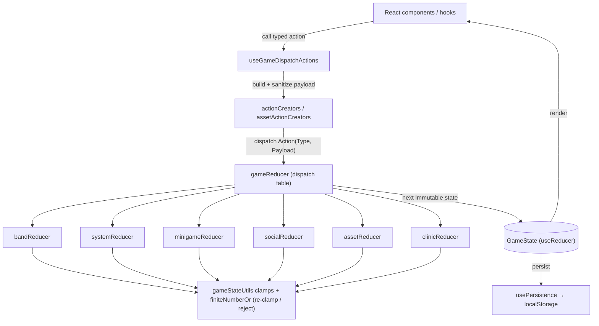

# Structural Improvement Plan — Neurotoxic

A plan calibrated to **this** codebase's actual state (React 19 + TypeScript + Pixi.js + Tone.js, custom reducer/action-creator state layer), not a generic template. Every action below is tagged:

- ✅ **Already in place** — no work, listed so the plan is honest about scope.
- 🎯 **Do** — concrete, verified gap worth fixing.
- ⛔ **Avoid** — requested in the generic brief but conflicts with `AGENTS.md` (pinned deps, surgical-changes, no speculative abstraction); rationale given.

**Guardrails (from `AGENTS.md`/`CLAUDE.md`):** surgical changes only; no new dependencies without discussion; no abstractions for single-use code; match existing style; every changed line traces to a goal. Each **code-changing** phase has a verification gate: `pnpm run lint && pnpm run typecheck:core && pnpm run typecheck && pnpm run test:all && pnpm run symbols:check`. The doc/report-only phases (0 and 5) change no source and are exempt — marked `—` in the roadmap.

---

## Grounding snapshot (measured, not assumed)

| Signal                                                                           | Value                                                                        |
| -------------------------------------------------------------------------------- | ---------------------------------------------------------------------------- |
| Function-like declarations > 100 lines (AST scan, all src, incl. private/nested) | **16**                                                                       |
| Runtime dependencies / dev dependencies                                          | 18 / 45                                                                      |
| ESLint / Stylelint / Prettier / `typecheck:core` / reducer `typecheck`           | all clean                                                                    |
| Orphaned exports (post symbol-index fix)                                         | 0                                                                            |
| CI workflows                                                                     | `eslint.yml`, `test.yml`, `codeql.yml`, `deploy.yml`, `lint-fix-preview.yml` |
| Pre-commit                                                                       | husky + lint-staged (`eslint --fix`, `prettier --write`)                     |

The codebase is already lint-clean, type-clean, has centralized state, a `GameError` hierarchy, and CI. The high-value work is concentrated in **Modularization (item 1)**; items 2/4/5 are largely _maintenance_ of existing systems; item 3 is _document, don't replace_.

---

## 1. Modularization — 🎯 the real work

### Audit result (functions > 100 lines)

Data registries (`CHATTER_DB`, `BRAND_DEALS`, `POST_OPTIONS`, `*_EVENTS`, `HQ_ITEMS`, `QUEST_REGISTRY`, `MILESTONES`) are **excluded** — they are flat config arrays, not "monolithic functions"; splitting them adds indirection with no benefit. The genuine function candidates:

| Lines | Symbol                          | File                                                 | Notes                                                                          |
| ----- | ------------------------------- | ---------------------------------------------------- | ------------------------------------------------------------------------------ |
| 641   | `useGameDispatchActions`        | `src/context/useGameDispatchActions.ts`              | **Top priority.** Bundles ~50 dispatch wrappers; cleanly splittable by domain. |
| 249   | `useAmpLogic`                   | `src/hooks/minigames/useAmpLogic.ts`                 | Hook + nested `updateAmpGameState` (184).                                      |
| 187   | `useContinueHandler`            | `src/hooks/postGig/handlers/useContinueHandler.ts`   |                                                                                |
| 175   | `_generateIntermediateLayers()` | `src/utils/mapGenerator.ts`                          | Pure logic — easiest, lowest-risk to decompose + test.                         |
| 165   | `useSocialPostHandler`          | `src/hooks/postGig/handlers/useSocialPostHandler.ts` |                                                                                |
| 150   | `resolveEvent`                  | `src/domain/eventResolver.ts`                        | Pure domain logic.                                                             |
| 145   | `ensureAudioContext`            | `src/utils/audio/context.ts`                         | Lifecycle-sensitive — touch with care.                                         |
| 133   | `usePersistence`                | `src/context/usePersistence.ts`                      |                                                                                |
| 116   | `drawWaves()`                   | `src/components/stage/AmpWaveManager.ts`             | Pixi render loop — perf-sensitive.                                             |
| 116   | `useDealHandlers`               | `src/hooks/postGig/handlers/useDealHandlers.ts`      |                                                                                |
| 110   | `generateMap()`                 | `src/utils/mapGenerator.ts`                          |                                                                                |
| 107   | `usePostGigHandlers`            | `src/hooks/usePostGigHandlers.ts`                    |                                                                                |
| 107   | `startGigPlayback`              | `src/utils/audio/gigPlayback.ts`                     | Audio timing — care.                                                           |
| 106   | `disposeAudio`                  | `src/utils/audio/dispose.ts`                         |                                                                                |
| 101   | `resolveOverlaps()`             | `src/utils/mapGenerator.ts`                          | Pure logic.                                                                    |

(16 total — note "long" hooks are often a list of small `useCallback`s; length alone isn't a defect. Prioritize by **branching complexity**, not raw lines.)

### Actions

- 🎯 **Decompose `useGameDispatchActions` (641)** — group the dispatch wrappers into domain sub-hooks (`useBandDispatch`, `useAssetDispatch`, `useMinigameDispatch`, …) that the parent composes. Pure mechanical extraction; public hook signature unchanged. Highest payoff.
- 🎯 **Decompose the pure-logic functions first** (`mapGenerator` helpers, `resolveEvent`) — extract single-responsibility helpers behind explicit signatures; these are the lowest risk because they're side-effect-free and already test-covered.
- ⛔ **Do NOT touch `drawWaves`, `startGigPlayback`, `ensureAudioContext` for length alone** — these are perf/timing/lifecycle-critical (Pixi ticker, Tone.js timing via `getGigTimeMs`, AudioContext unlock). Splitting risks regressions for cosmetic gain; only refactor if a _behavioral_ bug is found.
- 🎯 **Interfaces/contracts:** each extracted module gets an explicit TypeScript signature (params/return types — `AGENTS.md` requires this on public members) and a TSDoc summary. No `any`; narrow `unknown` at boundaries.
- 🎯 **Regression safety:** TDD — characterize current behavior with a test _before_ extracting, then refactor until green. Use the existing runners (`node:test` for pure logic, Vitest for hooks/components per the same-file convention).
- ✅ **Architecture diagram:** see the Mermaid state diagram below; per-subsystem diagrams generated on demand from `symbols.json` `dependencies`/`usedBy`.

**Gate per function:** behavior test green before+after; `typecheck:core`; `symbols:update` + `symbols:check`.

---

## 2. Dependency Management — mostly ✅, one ⛔

- ✅ **Catalog & versioning:** 18 pinned runtime deps, 45 dev. pnpm is the SoT (`pnpm-lock.yaml`); versions are **intentionally pinned** (`AGENTS.md`: "Do not upgrade pinned dependencies without discussion").
- ✅ **CI against the dep tree:** `test.yml` + `eslint.yml` + `codeql.yml` already run on PRs.
- ✅ **Imports correct/used:** ESLint clean (no unused/unresolved imports); `symbols.json` reports **0 orphaned exports** and a full import graph (`usedBy`/`dependencies`/`referencedBy`).
- 🎯 **Light dependency review (report only):** flag candidates for discussion — e.g. `playwright` sits in `dependencies` (usually devDep); `motion-dom`/`motion-utils` are `framer-motion` internals that may not need to be top-level. **Propose, don't change** — pinned-dep policy requires sign-off.
- ⛔ **"Module-level dependency-injection system":** NOT recommended. The project uses ES-module imports + the symbol index for coupling visibility; a DI container is speculative abstraction that `AGENTS.md` ("no flexibility/configurability that wasn't requested") explicitly discourages and would add indirection without a testability problem to solve (hooks/reducers are already unit-tested by direct import).
- ⛔ **"Switch to npm/pip/Maven":** N/A — pnpm is already the standard and mandated; do not introduce a second package manager.

---

## 3. State Management — ✅ already centralized; 🎯 document only

The app **already has** a centralized, predictable state system equivalent to what the brief asks for:

- ✅ **Single source of truth:** `GameState` via `useReducer`; all updates go through action creators → `gameReducer` dispatch table → domain sub-reducers (`AGENTS.md`: "All state updates go through action creators"). Two-layer payload safety (creators normalize; reducers re-clamp/reject) is already enforced and was hardened earlier this branch.
- ⛔ **"Implement Redux / MobX":** NOT recommended. Adding a state library = a new runtime dependency (forbidden without discussion) **and** a large rewrite of a working, idiomatic React-19 reducer system that already gives predictable, immutable transitions. This is the textbook "refactor things that aren't broken" anti-pattern.
- 🎯 **Document state transitions:** add a `docs/state-machine.md` with scene/phase flow (INTRO→MENU→OVERWORLD→PREGIG→GIG→POSTGIG→GAMEOVER) and the action→reducer map — the diagram above is the seed. Low risk, high onboarding value.
- 🎯 **State-change logging:** a thin dev-only logging middleware around `dispatch` (gated by the existing `logger` + log level) for debuggability — _no_ behavior change in production.
- ✅ **Review enforcement:** the `state-safety-action-creator-guard` skill + reducer `typecheck` gate + `tests/context/reducers` already enforce best practices.

---

## 4. Code Style — ✅ already enforced; 🎯 docs polish

- ✅ **Style guide + automation:** ESLint + Prettier + Stylelint, run in CI (`eslint.yml`) **and** pre-commit (husky + lint-staged). Tailwind v4 token rules and brand-color constraints are codified in `AGENTS.md`. (This branch already fixed the only 2 files with Prettier drift.)
- 🎯 **Doc-comment coverage:** TSDoc exists on most exported APIs (the symbol index captures `jsDoc`). Targeted pass: add TSDoc to exported symbols currently missing a summary (query `symbols.json` for entries without `jsDoc`), per the `tsdoc-writer` conventions. Incremental, no logic change.
- ⛔ **PEP8 / Airbnb / Google Java guides:** N/A — single-language (TS/JS) project with its own enforced config; don't bolt on foreign guides.

---

## 5. Error Handling — ✅ robust; 🎯 fill specific gaps only

- ✅ **Custom error types:** `GameError` → `StateError` / `StorageError` / `AudioError` hierarchy (`src/utils/errorHandler.ts`); centralized `handleError` + `logger`.
- ✅ **try/catch in async init & lifecycle:** verified in the prior subsystem audit — `BaseStageController._performInit`/`_handleInitError`, `AudioSystem.init/ensureAudioContext/startAmbient`, storage ops via `runSafeStorageOperation` with retry+fallback.
- ✅ **Graceful fallbacks:** `ResizeObserver`→`window.resize`; audio returns `false` instead of throwing; reducers reject malformed payloads by returning unchanged state.
- 🎯 **Targeted gap pass (report-then-fix):** scan for `async` functions at I/O boundaries (asset/network/storage) lacking a `try/catch` or a typed error; add the missing guard + a `logger` call with actionable context. Only where a real unguarded boundary exists — not blanket wrapping.

---

## Phased roadmap

| Phase | Scope                                                                                               | Risk          | Gate                                 |
| ----- | --------------------------------------------------------------------------------------------------- | ------------- | ------------------------------------ |
| **0** | Land docs: this plan + `docs/state-machine.md` (item 3 diagram)                                     | none          | —                                    |
| **1** | Modularize the 3 pure-logic functions (`mapGenerator` ×3, `resolveEvent`) behind tests              | low           | behavior tests + typecheck + symbols |
| **2** | Decompose `useGameDispatchActions` (641) into domain sub-hooks                                      | medium        | full gate + golden-path tests        |
| **3** | Decompose remaining postGig/minigame handler hooks (where complexity, not just length, warrants it) | medium        | full gate                            |
| **4** | TSDoc coverage pass; dev-only dispatch logging middleware                                           | low           | full gate                            |
| **5** | Dependency-review _report_ (playwright placement, motion internals) for maintainer sign-off         | none (report) | —                                    |

**Deliberately not in scope:** Redux/MobX migration, a DI container, dependency upgrades, splitting perf/timing-critical audio & Pixi functions for length alone, and reformatting/refactoring code with no measured defect — all per `AGENTS.md` (surgical changes, pinned deps, no speculative abstraction).

---

## Open decisions for the maintainer

1. Approve Phase 2 (`useGameDispatchActions` split) — it's mechanical but touches the dispatch surface many components consume.
2. Confirm the dependency-review items are wanted as a _report_ (no version changes without your go-ahead).
3. Confirm Redux/MobX and DI are intentionally **out** (recommended), or say if you specifically want one despite the cost.
