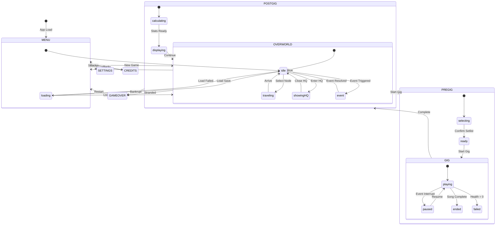
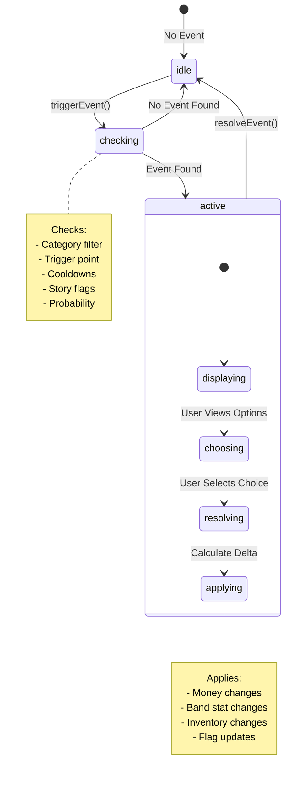
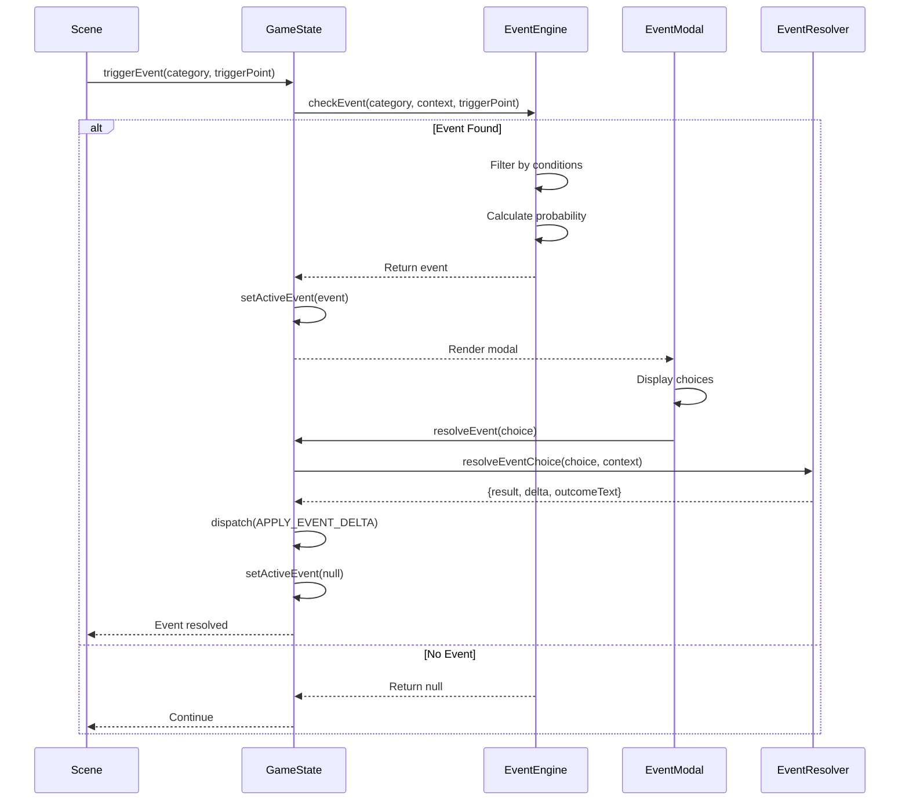
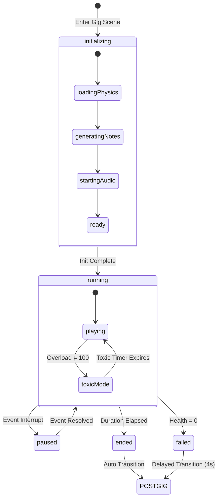
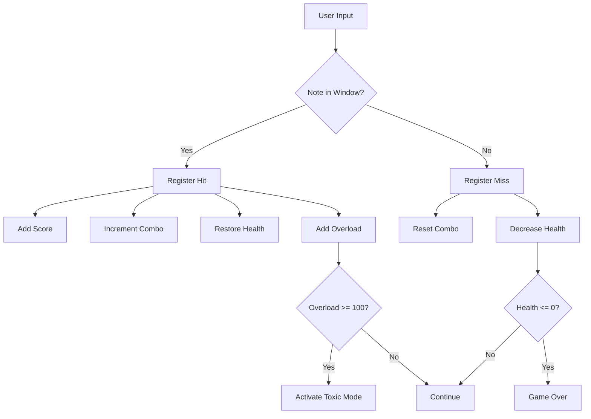
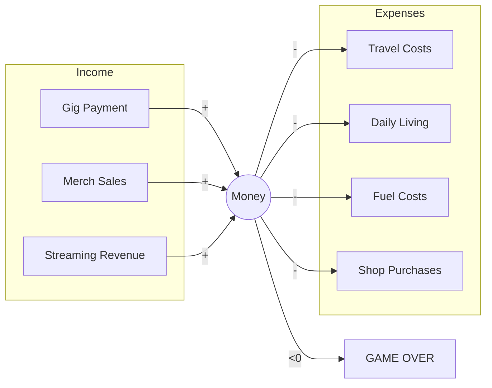
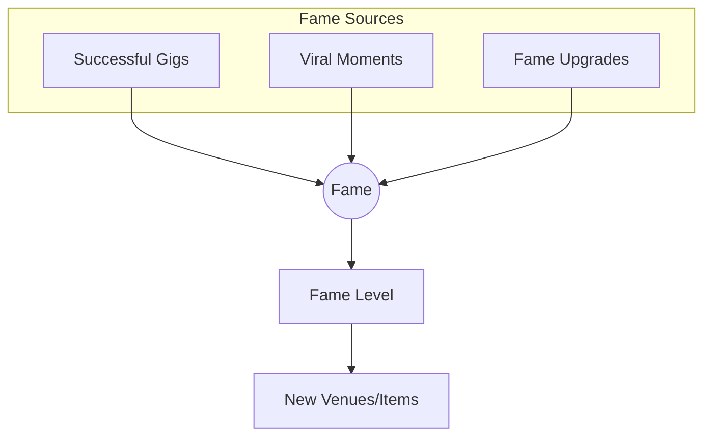
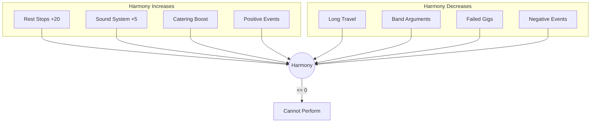

# State Transitions Documentation

This document provides detailed information about state transitions in the Neurotoxic game, including state diagrams, transition rules, and debugging guidelines.

## Table of Contents

1. [Scene State Machine](#scene-state-machine)
2. [Event State Machine](#event-state-machine)
3. [Gig State Machine](#gig-state-machine)
4. [Player State Transitions](#player-state-transitions)
5. [Debugging State Issues](#debugging-state-issues)

---

## Scene State Machine

### State Diagram



### Scene Transition Rules

| From Scene | To Scene  | Trigger                    | Conditions                          |
| ---------- | --------- | -------------------------- | ----------------------------------- |
| MENU       | OVERWORLD | `changeScene('OVERWORLD')` | New game or valid save loaded       |
| OVERWORLD  | PREGIG    | `startGig(venue)`          | Harmony > 0, at GIG node            |
| PREGIG     | GIG       | `changeScene('GIG')`       | Setlist selected                    |
| GIG        | POSTGIG   | `changeScene('POSTGIG')`   | Song duration elapsed or health = 0 |
| POSTGIG    | OVERWORLD | `changeScene('OVERWORLD')` | User clicks continue                |
| ANY        | GAMEOVER  | `changeScene('GAMEOVER')`  | Money < 0 or stranded               |

---

## Event State Machine

### State Diagram



### Event Flow



### Event Trigger Points

| Trigger Point | When Fired             | Category            |
| ------------- | ---------------------- | ------------------- |
| `travel`      | After arriving at node | `transport`, `band` |
| `gig_start`   | Before gig begins      | `gig`               |
| `gig_end`     | After gig completes    | `gig`, `financial`  |
| `daily`       | On day advance         | `band`, `financial` |
| `special`     | At special nodes       | `special`           |

---

## Gig State Machine

### State Diagram



### Gig State Variables

```javascript
gameStateRef = {
  running: boolean, // Is game loop active
  paused: boolean, // Is game paused
  isGameOver: boolean, // Has player failed
  startTime: number, // Game start timestamp
  pauseTime: number | null, // When paused (for time correction)
  totalDuration: number, // Song duration in ms
  speed: number, // Note scroll speed
  notes: Array, // Note objects
  lanes: Array, // Lane configurations
  modifiers: Object, // Active gig modifiers
  stats: {
    perfectHits: number,
    misses: number,
    maxCombo: number,
    peakHype: number
  }
}
```

### Hit Detection Flow



---

## Player State Transitions

### Money Transitions



### Fame Transitions



### Band Harmony Transitions



---

## Debugging State Issues

### Common State Problems

#### 1. State Not Updating

```javascript
// Wrong: Direct mutation
state.player.money = 100

// Correct: Use action creator
dispatch(createUpdatePlayerAction({ money: 100 }))
```

#### 2. Stale State in Callbacks

```javascript
// Wrong: Captures stale state
const handleClick = () => {
  console.log(state.player.money) // May be outdated
}

// Correct: Use ref or callback form
const handleClick = () => {
  setMoney(prev => {
    console.log(prev) // Current value
    return prev + 100
  })
}
```

#### 3. Race Conditions

```javascript
// Wrong: Multiple rapid updates
updatePlayer({ money: player.money + 100 })
updatePlayer({ money: player.money + 50 }) // Uses stale value

// Correct: Single update or functional update
updatePlayer({ money: player.money + 150 })
```

### Debug Tools

#### Error Log Inspection

```javascript
import { getErrorLog } from './utils/errorHandler'

// In DebugLogViewer or console
const errors = getErrorLog()
console.table(errors)
```

#### State Snapshot

```javascript
// In GameState.jsx, add to provider value:
__DEV_getState: () => state,

// In console:
const state = useGameState().__DEV_getState();
```

### State Validation Checklist

- [ ] All actions dispatched through action creators
- [ ] No direct state mutations
- [ ] Async operations properly handled
- [ ] Error states have recovery paths
- [ ] State migrations for saved games
- [ ] Default values for all optional fields

---

## State Migration

When adding new state fields, update the `LOAD_GAME` handler in `gameReducer.js`:

```javascript
// Example: Adding new player field
const mergedPlayer = {
  ...DEFAULT_PLAYER_STATE, // Includes new defaults
  ...loadedState.player, // Saved values override
  newField: loadedState.player?.newField ?? DEFAULT_PLAYER_STATE.newField
}
```

This ensures backward compatibility with existing save files.

_Documentation sync: dependency/tooling baseline reviewed on 2026-02-17._
