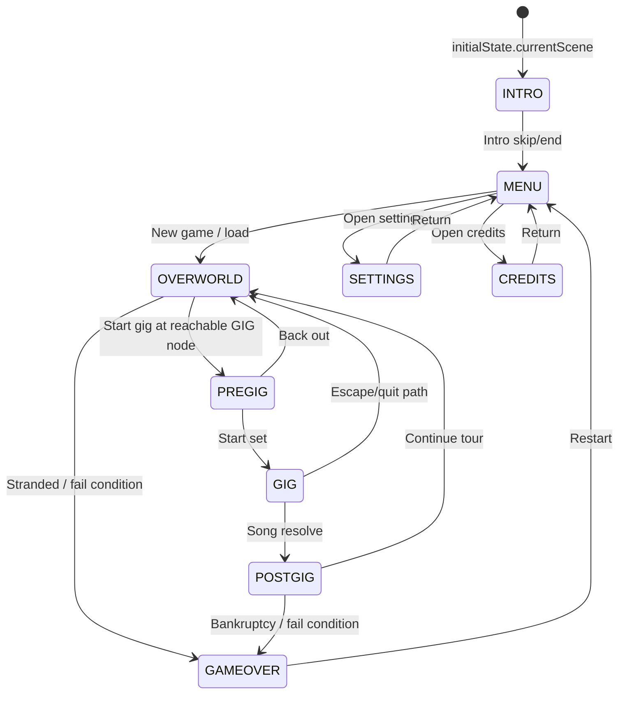

# State Transitions Documentation

This document tracks current scene/state transitions implemented in `GameState`, reducer actions, and scene components.

## Scene State Machine

## Reducer-Driven Transition Rules

| Action | Transition | Notes |
| --- | --- | --- |
| `CHANGE_SCENE` | `* -> payload` | Generic scene transition entrypoint. |
| `START_GIG` | `* -> PREGIG` | Also sets `currentGig`. |
| `LOAD_GAME` | `* -> safeLoadedScene` | Scene validated against allowlist. |
| `RESET_STATE` | `* -> INTRO` | Uses fresh initial state factory. |

## Event Lifecycle

Notes:
- `activeEvent` controls modal visibility.
- `pendingEvents`, `eventCooldowns`, and `activeStoryFlags` constrain repeat/event pacing.

## Core Resource Transitions

### Money
- Updated through player updates, gig results, and event deltas.
- Clamped in reducer to never drop below zero.

### Harmony
- Updated by travel/events/gig outcomes.
- Clamped in reducer to stay in valid gameplay range (`1..100`).

### Day progression
- `ADVANCE_DAY` advances simulation and can trigger downstream economy/social effects.

## Gig Runtime State (High level)

Gig internals are managed by rhythm hooks and Pixi stage runtime:
- `useRhythmGameLogic` orchestrates rhythm lifecycle.
- `hooks/rhythmGame/*` modules manage timing loop, scoring, input, notes, and effects.
- Final gig stats are persisted via `SET_LAST_GIG_STATS` and consumed in `POSTGIG`.

---

_Last updated: 2026-02-23._
