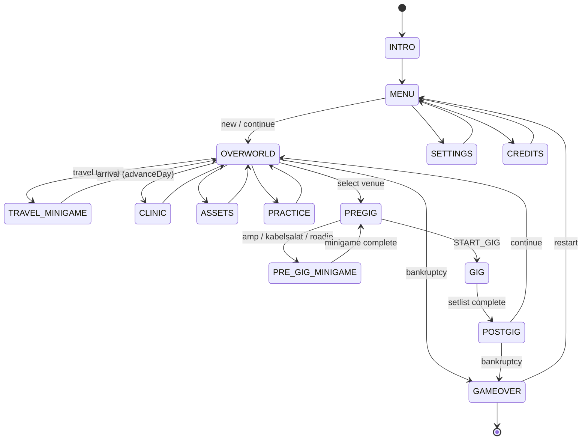
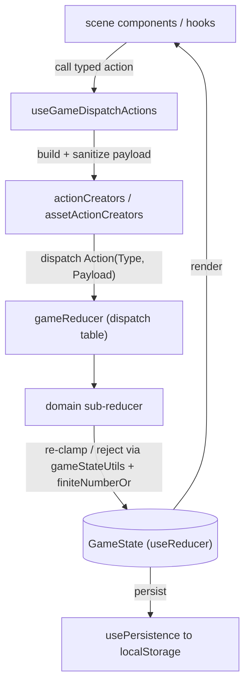

# State Machine & State-Management Reference

Companion to `docs/REFACTOR_PLAN.md` (Phase 0 deliverable). Documents how
application state is modeled, how it transitions, and the invariants that keep
transitions predictable. Source of truth lives in code; this doc summarizes it.

- **Single store:** one `GameState` object held by `useReducer` in
  `src/context/GameState.tsx`.
- **One write path:** UI never mutates state directly. Components/hooks call
  action creators (`src/context/actionCreators.ts`,
  `assetActionCreators.ts`) which build a typed `Action<Type, Payload>`; the
  root `gameReducer` (`src/context/gameReducer.ts`) routes each action through a
  dispatch table to a domain sub-reducer.
- **Two-layer payload safety:** action creators normalize/drop locally-invalid
  raw fields; reducers remain the final authority and re-clamp / reject hostile
  payloads (returning unchanged state). See _Invariants_ below.

---

## 1. Scene state machine

`currentScene: GamePhase` (`src/types/game.d.ts`) is one of the 14 values frozen
in `GAME_PHASES` (`src/context/gameConstants.ts`):

`INTRO · MENU · OVERWORLD · PREGIG · PRE_GIG_MINIGAME · TRAVEL_MINIGAME · GIG · POSTGIG · PRACTICE · CLINIC · ASSETS · SETTINGS · CREDITS · GAMEOVER`

Scene changes are dispatched as `CHANGE_SCENE` (handled by `sceneReducer`) from
scene components and overlay continue-callbacks — **not** from gameplay
reducers. (Minigame-completion reducers deliberately preserve `currentScene`;
see Invariants.) The canonical gameplay loop:

The golden-path integration tests assert the core cycle
`INTRO → MENU → OVERWORLD → PREGIG → GIG → POSTGIG` plus `GAMEOVER` paths
(`tests/golden-path/`).

---

## 2. Dispatch architecture

---

## 3. Action → reducer-module map

Every action type in `gameReducer`'s dispatch table routes to exactly one
domain reducer module under `src/context/reducers/`:

| Module            | Representative actions                                                                                                                                                                              |
| ----------------- | --------------------------------------------------------------------------------------------------------------------------------------------------------------------------------------------------- |
| `sceneReducer`    | `CHANGE_SCENE`                                                                                                                                                                                      |
| `playerReducer`   | `UPDATE_PLAYER`                                                                                                                                                                                     |
| `bandReducer`     | `UPDATE_BAND` (+ shared band effects)                                                                                                                                                               |
| `socialReducer`   | `UPDATE_SOCIAL`, `PIRATE_BROADCAST`, `MERCH_PRESS`, `DARK_WEB_LEAK`, `UNBLACKLIST_VENUE`                                                                                                            |
| `gigReducer`      | `SET_GIG`, `START_GIG`, `SET_SETLIST`, `SET_LAST_GIG_STATS`, `SET_GIG_MODIFIERS`                                                                                                                    |
| `eventReducer`    | `SET_ACTIVE_EVENT`, `APPLY_EVENT_DELTA`, `POP_PENDING_EVENT`                                                                                                                                        |
| `minigameReducer` | `START_/COMPLETE_` × `TRAVEL`, `ROADIE`, `KABELSALAT`, `AMP_CALIBRATION`                                                                                                                            |
| `clinicReducer`   | `CLINIC_HEAL`, `CLINIC_ENHANCE`, `BLOOD_BANK_DONATE`                                                                                                                                                |
| `questReducer`    | `ADD_QUEST`, `ADVANCE_QUEST`, `APPLY_QUEST_EVENT`                                                                                                                                                   |
| `rivalReducer`    | `SPAWN_/MOVE_/CHECK_/UPDATE_RIVAL_BAND`                                                                                                                                                             |
| `tradeReducer`    | `TRADE_VOID_ITEM`                                                                                                                                                                                   |
| `assetReducer`    | `PURCHASE_/UPGRADE_/SELL_/REPAIR_CHASSIS`, `INSTALL_/REMOVE_MODULE`, `START_CROWDFUND`, `REFINANCE_LIABILITY`, `ASSET_FORECLOSED`, `*_FAILED`                                                       |
| `systemReducer`   | `UPDATE_SETTINGS`, `SET_MAP`, `ADD_/REMOVE_TOAST`, `LOAD_GAME`, `RESET_STATE`, `ADVANCE_DAY`, `ADD_COOLDOWN`, `ADD_UNLOCK`, `SET_PENDING_*`, `DISMISS_FORECLOSURE_NOTICE`, `SET_PENDING_RISK_EVENT` |

New actions must update `actionTypes`, the reducer handler, and `actionCreators`
together.

---

## 4. State-transition invariants

These are enforced in code (and `AGENTS.md`); they keep transitions
predictable:

- **Reducers are the final authority.** They re-clamp computed numeric state
  with canonical helpers (`clampBandHarmony`, `clampMemberMood`,
  `clampMemberStamina`, `clampPlayerMoney`, …) and reject malformed/hostile
  payloads by returning unchanged state — even though action creators already
  normalized input.
- **Finite arithmetic.** Arithmetic-then-clamp paths wrap persisted addends with
  `finiteNumberOr(value, fallback)` (`src/utils/finiteNumber.ts`) so stale saves
  with `NaN`/`undefined` numerics cannot corrupt a clamp.
- **`ADVANCE_DAY` is deterministic.** Always dispatch via the typed
  `advanceDay(state)` creator — RNG determinism depends on the
  `dayRngStream` + `nextRngSeed` payload; never dispatch a payloadless variant.
- **`START_GIG` resets `gigModifiers`** to defaults.
- **Minigame-completion reducers must not change `currentScene`**
  (`COMPLETE_TRAVEL_MINIGAME`, `COMPLETE_AMP_CALIBRATION`,
  `COMPLETE_KABELSALAT_MINIGAME`, `COMPLETE_ROADIE_MINIGAME`); arrival / overlay
  continue-callbacks own the scene change.
- **Bankruptcy** consults `getTotalDailyObligations(state)`
  (`src/utils/assetSelectors.ts`), which folds in asset upkeep/revenue and
  liability payments — not `calculateGuaranteedDailyCost` alone.
- **Persistence.** `usePersistence` loads/saves through `LOAD_GAME` /
  serialization; only `ALLOWED_SCENE_VALUES` scenes are restorable from saves.

### Debug logging (planned — Phase 4)

A dev-only logging middleware around `dispatch` (gated by the existing
`logger` + log level) is scoped in the refactor plan to make state transitions
inspectable without changing production behavior. Not yet implemented.
