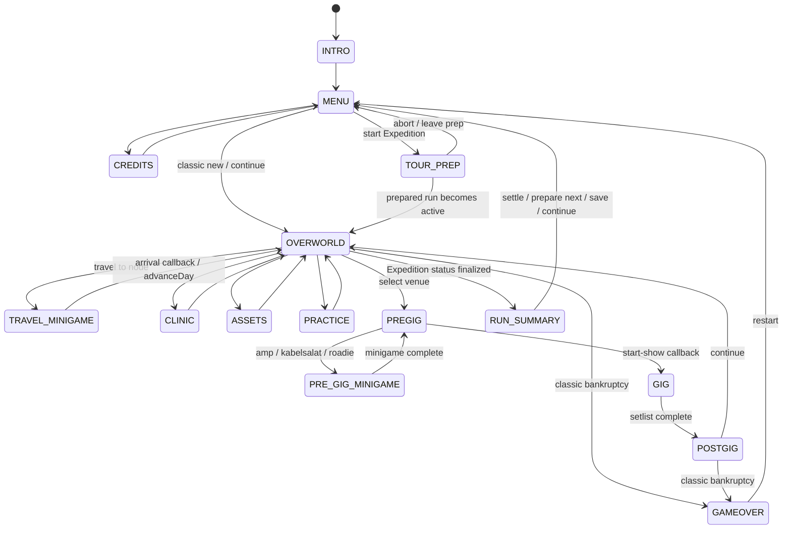
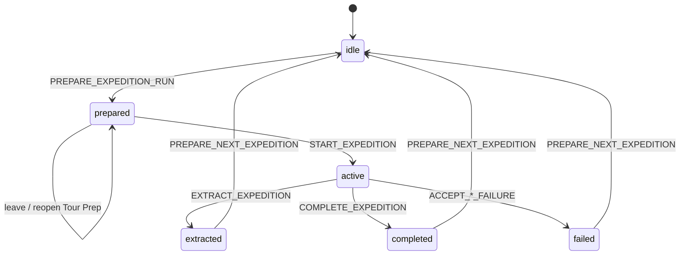
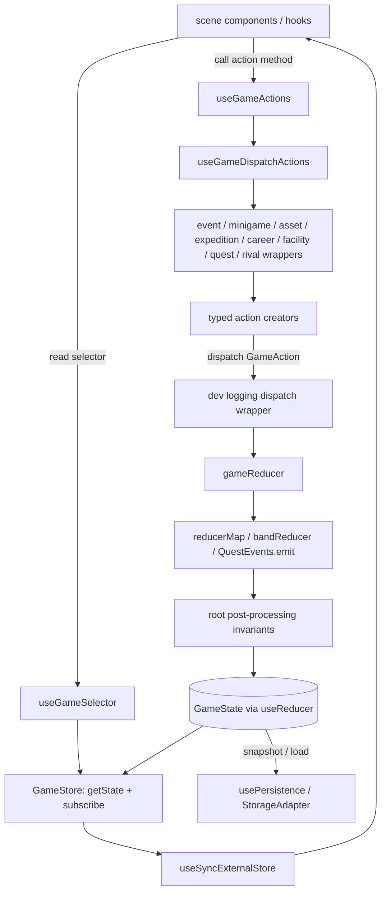

# State Machine & State-Management Reference

This document summarizes the current runtime state model, scene routing,
Roguelite Expedition lifecycle, persistence boundaries, and reducer invariants.
The source of truth is the code; this reference is intentionally descriptive,
not authoritative over implementation.

- **Single runtime state tree:** one `GameState` object is held by `useReducer`
  in `src/context/GameState.tsx`.
- **Split read/write surfaces:** components read state through
  `useGameSelector(...)` and mutate state through `useGameActions()`.
  `useGameSelector` is backed by a stable `GameStore` plus
  `useSyncExternalStore`; UI code does not receive a mutable `GameState`
  reference.
- **One runtime mutation path:** public dispatch methods are composed in
  `src/context/useGameDispatchActions.ts` and its domain-specific hooks. They
  build typed `GameAction` values through `actionCreators.ts` plus specialized
  creator modules such as `assetActionCreators.ts`,
  `expeditionActionCreators.ts`, and `careerActionCreators.ts`, then dispatch
  into the root `gameReducer`.
- **Reducer-authoritative safety:** creators normalize input and, where needed,
  derive ids, seeds, stale guards, or other intent metadata from the current
  state snapshot. Reducers remain the final authority: they revalidate,
  rederive canonical values, clamp arithmetic, and return the original state
  for illegal or stale actions.

---

## 1. Scene state machine

`currentScene: GamePhase` (`src/types/game.d.ts`) is derived from the values in
`GAME_PHASES` (`src/context/gameConstants.ts`). The current set contains 15
phases:

`INTRO · MENU · OVERWORLD · PREGIG · PRE_GIG_MINIGAME · TRAVEL_MINIGAME · GIG · POSTGIG · PRACTICE · CLINIC · ASSETS · CREDITS · GAMEOVER · TOUR_PREP · RUN_SUMMARY`

`SETTINGS` is no longer a scene value. Settings are state updated through
`UPDATE_SETTINGS`; `SceneRouter` has no settings route.

Scene navigation is owned by scene/UI orchestration. A requested scene change is
dispatched as `CHANGE_SCENE` and validated by `sceneReducer` against
`ALLOWED_SCENE_VALUES`. Gameplay reducers, including Expedition terminal
reducers, do not directly navigate.

The top-level flow is:

```mermaid
stateDiagram-v2
  [*] --> INTRO
  INTRO --> MENU

  MENU --> OVERWORLD: classic new / continue
  MENU --> CREDITS
  CREDITS --> MENU

  MENU --> TOUR_PREP: start Expedition
  TOUR_PREP --> MENU: abort / leave prep
  TOUR_PREP --> OVERWORLD: prepared run becomes active

  OVERWORLD --> TRAVEL_MINIGAME: travel to node
  TRAVEL_MINIGAME --> OVERWORLD: arrival callback / advanceDay

  OVERWORLD --> CLINIC
  OVERWORLD --> ASSETS
  OVERWORLD --> PRACTICE
  CLINIC --> OVERWORLD
  ASSETS --> OVERWORLD
  PRACTICE --> OVERWORLD

  OVERWORLD --> PREGIG: select venue
  PREGIG --> PRE_GIG_MINIGAME: amp / kabelsalat / roadie
  PRE_GIG_MINIGAME --> PREGIG: minigame complete
  PREGIG --> GIG: start-show callback
  GIG --> POSTGIG: setlist complete
  POSTGIG --> OVERWORLD: continue

  OVERWORLD --> RUN_SUMMARY: Expedition status finalized
  RUN_SUMMARY --> MENU: settle / prepare next / save / continue

  OVERWORLD --> GAMEOVER: classic bankruptcy
  POSTGIG --> GAMEOVER: classic bankruptcy
  GAMEOVER --> MENU: restart
```

The Expedition reuses the existing Overworld, travel, PreGig, Gig, and PostGig
scenes rather than introducing a parallel gameplay router. `TourPrep` commits an
Expedition build and then returns to `OVERWORLD`; finalized runs are observed by
`ExpeditionRunControls` on the Overworld, persisted, and routed to
`RUN_SUMMARY`.

### Expedition run lifecycle

The run-scoped `expedition.status` is a nested state machine independent from
`currentScene`:

```mermaid
stateDiagram-v2
  [*] --> idle
  idle --> prepared: PREPARE_EXPEDITION_RUN
  prepared --> prepared: leave / reopen Tour Prep
  prepared --> active: START_EXPEDITION
  active --> extracted: EXTRACT_EXPEDITION
  active --> completed: COMPLETE_EXPEDITION
  active --> failed: ACCEPT_*_FAILURE
  extracted --> idle: PREPARE_NEXT_EXPEDITION
  completed --> idle: PREPARE_NEXT_EXPEDITION
  failed --> idle: PREPARE_NEXT_EXPEDITION
```

Important consequences:

- `PREPARE_EXPEDITION_RUN` is accepted only from `idle`. Leaving Tour Prep does
  not cancel the prepared run, so reopening it is edit-only and does not reroll
  `runSeed` or the previewed route.
- `START_EXPEDITION` moves `prepared → active` only after the reducer revalidates
  the prepared id, root seed, loadout, route, costs, and sponsor provenance.
- `extracted`, `completed`, and `failed` are terminal run states. Their
  settlement remains available for `RUN_SUMMARY` until
  `PREPARE_NEXT_EXPEDITION` is allowed to clear it.

The classic tour cycle remains covered by the golden-path suites under
`tests/golden-path/`; Expedition terminal save-before-navigation behavior is
also asserted in `tests/ui/ExpeditionRunControls.test.tsx`.

---

## 2. Read and dispatch architecture

```mermaid
flowchart TD
  UI["scene components / hooks"]

  UI -->|"read selector"| SEL["useGameSelector"]
  SEL --> GS["GameStore: getState + subscribe"]
  GS --> USS["useSyncExternalStore"]
  USS --> UI

  UI -->|"call action method"| GA["useGameActions"]
  GA --> DA["useGameDispatchActions"]
  DA --> DOMAIN["event / minigame / asset / expedition / career / facility / quest / rival wrappers"]
  DOMAIN --> AC["typed action creators"]
  AC -->|"dispatch GameAction"| LOG["dev logging dispatch wrapper"]
  LOG --> RD["gameReducer"]
  RD --> OWN["reducerMap / bandReducer / QuestEvents.emit"]
  OWN --> POST["root post-processing invariants"]
  POST --> ST[("GameState via useReducer")]

  ST --> GS
  ST -->|"snapshot / load"| PS["usePersistence / StorageAdapter"]
```

`useGameDispatchActions` is an orchestration layer, not a second store. It
composes smaller dispatch hooks and can sequence state actions with storage side
effects when durability is part of the command. Expedition helpers read
`stateRef.current` so creators derive stale guards and deterministic tokens from
the same snapshot the reducer will validate.

The `GameStateProvider` wraps React's raw reducer dispatch with a dev-only
logger, then passes the same dispatch into all domain wrappers. There is still
only one reducer-owned state tree.

---

## 3. Action → handler-owner map

Most action types route through `gameReducer`'s typed `reducerMap`. Band actions
are deliberately delegated as a group to `bandReducer`, and
`APPLY_QUEST_EVENT` calls `QuestEvents.emit` directly from the root map.

| Handler owner | Representative actions |
| --- | --- |
| `sceneReducer` | `CHANGE_SCENE` |
| `playerReducer` | `UPDATE_PLAYER` |
| `bandReducer` | `UPDATE_BAND`, `USE_CONTRABAND`, `CONSUME_ITEM`, `UNLOCK_TRAIT`, `TOGGLE_NEURO_DECIMATOR`, `CRAFT_ITEM` |
| `socialReducer` | `UPDATE_SOCIAL`, `PIRATE_BROADCAST`, `MERCH_PRESS`, `DARK_WEB_LEAK`, `CULT_INDOCTRINATION`, `UNBLACKLIST_VENUE` |
| `gigReducer` | `SET_GIG`, `START_GIG`, `SET_SETLIST`, `SET_LAST_GIG_STATS`, `SET_GIG_MODIFIERS` |
| `eventReducer` | `SET_ACTIVE_EVENT`, `SET_SCREENSHOT_MODE`, `APPLY_EVENT_DELTA`, `POP_PENDING_EVENT`, `ADD_COOLDOWN` |
| `minigameReducer` | `START_/COMPLETE_` × `TRAVEL`, `ROADIE`, `KABELSALAT`, `AMP_CALIBRATION` |
| `clinicReducer` | `CLINIC_HEAL`, `CLINIC_ENHANCE`, `GRAFT_NEURO_OVERCLOCK`, `BLOOD_BANK_DONATE` |
| `questReducer` | `ADD_QUEST`, `ADVANCE_QUEST` |
| root `QuestEvents.emit` | `APPLY_QUEST_EVENT` |
| `rivalReducer` | `SPAWN_RIVAL_BAND`, `MOVE_RIVAL_BAND`, `CHECK_RIVAL_ENCOUNTER`, `UPDATE_RIVAL_BAND` |
| `tradeReducer` | `TRADE_VOID_ITEM` |
| `assetReducer` | `PURCHASE_/UPGRADE_/SELL_/REPAIR_CHASSIS`, `INSTALL_/REMOVE_MODULE`, `START_CROWDFUND`, `REFINANCE_LIABILITY`, `ASSET_FORECLOSED`, `DISMISS_FORECLOSURE_NOTICE`, asset `*_FAILED` |
| `systemReducer` | `UPDATE_SETTINGS`, `SET_MAP`, `ADD_/REMOVE_TOAST`, `LOAD_GAME`, `RESET_STATE`, `ADVANCE_DAY`, `ADD_UNLOCK`, `SET_PENDING_BANDHQ_OPEN`, `SET_PENDING_SUPPLY_STOP_INVENTORY`, `SET_PENDING_RISK_EVENT` |
| `expeditionReducer` | run prepare/start/advance, node intel, rewards, extraction/completion/failure, crises, repair/inspection/insurance, defects, event deltas, obligations, drafts, social results |
| `crewReducer` | `RECORD_EXPEDITION_CREW_STRESS_SOURCE`, `RECORD_EXPEDITION_RELATIONSHIP_OUTCOME`, `ADVANCE_EXPEDITION_CREW_INJURY`, `ADVANCE_EXPEDITION_BAND_INJURY`, `CREATE_CONTACT_INTEL_GRANT` |
| `careerReducer` | Expedition crew/career settlement, HQ facilities, unlock purchase journal, ascension, legendary rewards, archive discovery, between-tour decisions, crew signatures |

A new public action normally requires all affected contract layers to move
together:

1. add the discriminant to `src/context/actionTypes.ts`;
2. add/update the `GameAction` union and payload types;
3. add the creator in the appropriate action-creator module;
4. add the reducer handler and root routing entry (or explicit band ownership);
5. expose/update the relevant dispatch wrapper when UI code needs it; and
6. update the closest reducer/dispatch/integration tests.

---

## 4. State-transition invariants

These rules are enforced in code and are part of the effective state-machine
contract.

- **Reducers are the final authority.** Known actions with invalid, hostile,
  stale, or impossible payloads return the original state rather than trusting
  the caller. Unknown action shapes that bypass typed dispatch are warned and
  rejected by the root reducer's `assertNever` safety net.
- **Finite arithmetic.** Arithmetic-then-clamp paths use canonical clamp helpers
  and `finiteNumberOr(value, fallback)` so stale saves containing
  `NaN`/`undefined`-like numeric gaps cannot poison derived state.
- **Scene changes are explicit.** `sceneReducer` accepts only
  `ALLOWED_SCENE_VALUES`. Gameplay reducers preserve `currentScene`; this
  includes minigame-completion reducers and Expedition terminal reducers.
- **`ADVANCE_DAY` is deterministic.** Always dispatch through the typed
  `advanceDay(state)` creator. Its payload carries `dayRngStream` and
  `nextRngSeed`; a payloadless variant would break deterministic asset/day
  processing.
- **`ADVANCE_DAY` has root post-processing.** After the domain handler runs, the
  root reducer applies zero-condition asset foreclosures and milestone checks.
  Milestone reward/toast actions are re-entered through `gameReducer` so the
  same invariants apply to them.
- **`START_GIG` resets `gigModifiers`** to their defaults before the new gig is
  played.
- **Minigame completion never owns navigation.** `COMPLETE_TRAVEL_MINIGAME`,
  `COMPLETE_AMP_CALIBRATION`, `COMPLETE_KABELSALAT_MINIGAME`, and
  `COMPLETE_ROADIE_MINIGAME` update gameplay state but leave scene changes to
  arrival/overlay callbacks.
- **Bankruptcy uses total obligations.** Daily bankruptcy decisions consult
  `getTotalDailyObligations(state)` (`src/utils/assetSelectors.ts`), including
  asset upkeep/revenue and liability payments, rather than relying on
  `calculateGuaranteedDailyCost` alone.
- **The root `runSeed` is the single Expedition route seed owner.** The
  Expedition slice deliberately has no independent seed. PREPARE claims the
  root seed once; START rebuilds the canonical route from that seed plus the
  committed Tour/Region before accepting the run.
- **Expedition START is atomic and reducer-authoritative.** The reducer
  revalidates the loadout against the canonical map, checks prepared sponsor
  provenance, applies pre-run costs, installs the committed setlist and route,
  stamps run baselines, and only then moves the status to `active`.
- **Protected Career Cash is global.** After every action, the root reducer calls
  `enforceExpeditionCashFloor(previousState, nextState, action.type)`. A spend
  that crosses the protected slice is rejected back to the pre-action state;
  new spend paths do not need to remember a separate local guard.
- **Pending Expedition failure is derived centrally.** The root reducer calls
  `syncExpeditionPendingFailure(nextState)` after every action. Callers do not
  author the crisis directly, preventing the stored failure reason from
  drifting away from the state that caused it.
- **Terminal Expedition reducers do not navigate or persist.** They settle the
  run and record the terminal status/outcome. `ExpeditionRunControls` persists
  the committed state with `saveGameAfterStateCommit()` and then routes to
  `RUN_SUMMARY`.
- **Run summary is a settlement barrier.** Legendary claims, crew/career
  settlement, ascension, and between-tour decisions are handled before
  `PREPARE_NEXT_EXPEDITION` clears the run ledger. Persistence failures that
  would lose a required Legendary claim block further settlement.

---

## 5. Persistence and observability

### Persistence contract

`src/context/usePersistence.ts` defines `PERSISTED_FIELDS`, the source of truth
for the normal persisted `GameState` keys. The snapshot includes the classic
state plus `runSeed`, `expedition`, and `career`; `unlocks` and the save
timestamp are added explicitly.

Loading is migration- and sanitizer-gated:

- `usePersistence.loadGame()` parses, validates, migrates, merges persistent
  unlocks, builds a whitelisted raw payload, and dispatches `LOAD_GAME`.
- `handleLoadGame` sanitizes every accepted slice and **always forces
  `currentScene` to `OVERWORLD`**. A persisted `currentScene` is therefore not a
  resumable routing instruction.
- When a non-idle/non-prepared Expedition has a valid root `runSeed` and
  committed loadout, load reconstructs the canonical Expedition map and places
  the player on the last visited node.
- A missing/corrupt/non-canonical `runSeed` cannot safely reproduce the route;
  in that case the loaded Expedition collapses to the default idle state rather
  than being attached to a different map.

Autosave currently covers the classic transitions `GIG → POSTGIG` and
`POSTGIG → OVERWORLD/GAMEOVER`. Commands that require persistence without one
of those scene transitions use `saveGameAfterStateCommit()`. The Expedition
flow uses this explicitly when a run starts, when a terminal run is routed to
its summary, and when the summary is acknowledged and the next-run state is
committed.

### Dispatch logging

The previously planned dispatch middleware is implemented. In
`GameStateProvider`, raw reducer dispatch is wrapped in a stable callback that:

- logs `dispatch <ACTION_TYPE>` through `logger.debug` only when `import.meta.env.DEV`
  is true;
- remains subject to the configured logger level, so debug output disappears at
  `INFO` and above; and
- forwards the action unchanged to React's reducer dispatch, so production
  state behavior is unaffected.
