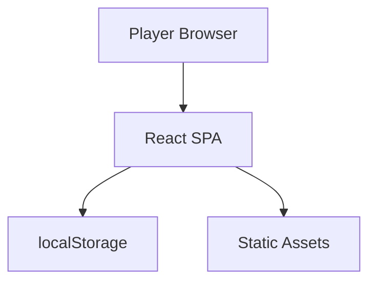

# Neurotoxic Game Threat Model

## Executive summary

NEUROTOXIC: GRIND THE VOID is a client-only React/Vite game intended for static hosting (GitHub Pages) with no backend or sensitive data handling. The primary risk themes are supply-chain or hosting integrity (tampered assets/scripts), client-side XSS if untrusted data ever enters DOM sinks, and localStorage integrity affecting game state (cheat/modification but not sensitive data exposure).

Evidence indicates a single-page React entry point and localStorage-based persistence without server-side processing.
【F:src/main.jsx†L1-L11】【F:src/context/GameState.jsx†L70-L260】

## Scope and assumptions

- **In-scope paths:** `src/` (runtime logic), `public/`, build tooling in `package.json`.【F:src/main.jsx†L1-L11】【F:package.json†L1-L56】
- **Out of scope:** Any infrastructure or hosting configuration not in this repository (GitHub Pages settings, CDN headers).
- **Assumptions:** Static hosting on GitHub Pages; publicly accessible; no PII/payments/accounts; no backend services in repository. (Provided by user.)
- **Open questions:** None materially affecting ranking based on confirmed assumptions.

## System model

### Primary components

- **React/Vite SPA runtime:** App bootstrap and component tree are mounted client-side in `src/main.jsx`.【F:src/main.jsx†L1-L11】
- **Game state + persistence:** Game state is stored in memory and persisted to localStorage (`neurotoxic_v3_save`, `neurotoxic_global_settings`).【F:src/context/GameState.jsx†L70-L260】
- **Audio subsystem:** MIDI assets are fetched via `fetch` and played with Tone.js/Howler.js wrappers for gameplay audio.【F:src/utils/audio/playback.js】【F:package.json†L19-L28】

### Data flows and trust boundaries

- **Browser user → React UI**
  - **Data:** User inputs (clicks/keyboard).
  - **Channel:** DOM events.
  - **Security guarantees:** Browser event model; no auth/session boundary.
  - **Validation:** Input handled in component logic; no explicit validation documented.
- **React runtime → localStorage**
  - **Data:** Game state, settings.
  - **Channel:** Web Storage API.
  - **Security guarantees:** Same-origin storage; no integrity protection.
  - **Validation:** `safeStorageOperation` wraps storage operations in error handling; schema validation performed on load. (State validation logic in `loadGame`.)【F:src/context/GameState.jsx†L70-L260】
- **React runtime → MIDI asset fetch**
  - **Data:** Asset URLs (MIDI files).
  - **Channel:** HTTP(S) `fetch` from same-origin static assets.
  - **Security guarantees:** Same-origin policy; HTTPS dependent on hosting.
  - **Validation:** MIDI duration and note scheduling guards in audio engine before playback. (Runtime skips invalid notes and validates durations.)【F:src/utils/audio/procedural.js】

#### Diagram

## Assets and security objectives

| Asset                         | Why it matters                       | Security objective (C/I/A) |
| ----------------------------- | ------------------------------------ | -------------------------- |
| Game save data (localStorage) | Preserves user progress and settings | Integrity, Availability    |
| Client JS bundle              | Determines app behavior and trust    | Integrity                  |
| MIDI/audio assets             | Core gameplay audio fidelity         | Integrity, Availability    |

## Attacker model

### Capabilities

- Public internet access to the static site.
- Ability to tamper with their own localStorage (client-side).
- Potential to exploit DOM XSS if an injection sink is introduced.

### Non-capabilities

- No direct server-side access (no backend present in repository).
- No access to secrets or PII (none stored/processed by the app).

## Entry points and attack surfaces

| Surface                  | How reached                                 | Trust boundary        | Notes                                           | Evidence (repository path / symbol)                                               |
| ------------------------ | ------------------------------------------- | --------------------- | ----------------------------------------------- | --------------------------------------------------------------------------------- |
| SPA bootstrap            | Browser loads `index.html` + `src/main.jsx` | Internet → Browser    | Primary entrypoint for code execution           | `src/main.jsx` render mount【F:src/main.jsx†L1-L11】                              |
| localStorage persistence | Game save/load actions                      | Browser → Storage     | Attacker can alter localStorage to affect state | `loadGame`/`saveGame` in `GameState.jsx`【F:src/context/GameState.jsx†L180-L260】 |
| MIDI asset fetch         | Gameplay audio start                        | Browser → Asset fetch | Same-origin assets loaded via `fetch`           | `playMidiFile` fetch in `src/utils/audio/procedural.js`                           |

## Top abuse paths

1. **Tamper game state** → Modify localStorage save → Load corrupted or unfair state → Game integrity loss (cheating).
2. **Supply-chain compromise** → Malicious dependency or altered bundle → User runs attacker-controlled script → Full client compromise within origin.
3. **Hosting asset tamper** → Replace MIDI/JS assets in static host → Audio/logic altered → Integrity loss or malicious behavior.
4. **Future DOM XSS** → Introduce unsafe HTML sink later → Untrusted data rendered → Script execution in user browser.
5. **Resource exhaustion** → Oversized asset or repeated playback → CPU/memory spike → App instability/DoS in browser.

## Threat model table

<!-- markdownlint-disable MD013 -->

| Threat ID | Threat source          | Prerequisites                                            | Threat action                                 | Impact                                       | Impacted assets        | Existing controls (evidence)                                                            | Gaps                                  | Recommended mitigations                                                                     | Detection ideas                          | Likelihood | Impact severity | Priority |
| --------- | ---------------------- | -------------------------------------------------------- | --------------------------------------------- | -------------------------------------------- | ---------------------- | --------------------------------------------------------------------------------------- | ------------------------------------- | ------------------------------------------------------------------------------------------- | ---------------------------------------- | ---------- | --------------- | -------- |
| TM-001    | Remote attacker        | Ability to tamper with localStorage in their own browser | Modify save/settings to change gameplay state | Integrity loss (cheating), potential crashes | Game save data         | Schema validation on load in `loadGame` path【F:src/context/GameState.jsx†L220-L260】   | No integrity/authentication of saves  | Add checksum or versioned validation to reject malformed saves; keep robust guards          | Client error logging for corrupted saves | High       | Low             | low      |
| TM-002    | Supply-chain attacker  | Compromised dependency or build pipeline                 | Inject malicious code into bundle             | Full client compromise within origin         | Client JS bundle       | None in repository (build tooling only)【F:package.json†L1-L56】                        | No integrity checks for hosted assets | Pin dependencies, enable Dependabot, audit lockfile; consider SRI if external scripts added | CI alerts on dependency changes          | Medium     | High            | medium   |
| TM-003    | Hosting/infra attacker | Ability to replace static assets                         | Serve modified JS/MIDI assets                 | Integrity loss, possible malicious behavior  | JS bundle, MIDI assets | None in repository (hosting out of scope)                                               | No signed assets                      | Enable HTTPS-only hosting; consider GitHub Pages integrity controls; monitor deploy logs    | Hosting access logs, deploy audit        | Low        | Medium          | low      |
| TM-004    | Future developer error | Introduction of unsafe HTML sinks                        | DOM XSS if untrusted data rendered            | Script execution in browser                  | Client JS bundle       | React rendering defaults reduce XSS risk                                                | No explicit linter rule for sinks     | Add ESLint rules or review checklist for `innerHTML`/`dangerouslySetInnerHTML`              | Code review checklist                    | Low        | Medium          | low      |
| TM-005    | Remote attacker        | Ability to trigger heavy audio/path loops                | Resource exhaustion by repeated actions       | App slowdown, audio glitches                 | Audio subsystem        | Audio engine guards for invalid notes/durations【F:src/utils/audio/midiUtils.js】       | No explicit rate limiting             | Add UI throttling on repeated actions; guard against extreme replay triggers                | Client performance telemetry             | Low        | Low             | low      |

<!-- markdownlint-enable MD013 -->

## Criticality calibration

- **Critical:** Would require user credentials/PII or server-side data compromise (not present). Example: theft of user accounts (not applicable).
- **High:** Client bundle compromise at scale (supply-chain or hosting tamper) leading to arbitrary script execution.
- **Medium:** Significant integrity loss that affects broad users (e.g., widespread asset tampering).
- **Low:** Local cheating or client-side instability without sensitive data exposure.

## Focus paths for security review

| Path                        | Why it matters                                       | Related Threat IDs |
| --------------------------- | ---------------------------------------------------- | ------------------ |
| `src/context/GameState.jsx` | LocalStorage persistence and schema checks           | TM-001             |
| `src/utils/audio/`          | Asset fetch + audio scheduling guards (new location) | TM-005             |
| `src/main.jsx`              | SPA entrypoint, trust boundary for browser execution | TM-002             |
| `package.json`              | Dependency surface for supply-chain risk             | TM-002             |

## Notes on use

- This threat model assumes static hosting on GitHub Pages with no backend services or sensitive data flows, per user-provided context.
- Evidence anchors are included per major claim to keep the model grounded in repository paths.

_Documentation sync: dependency/tooling baseline reviewed on 2026-02-23._
